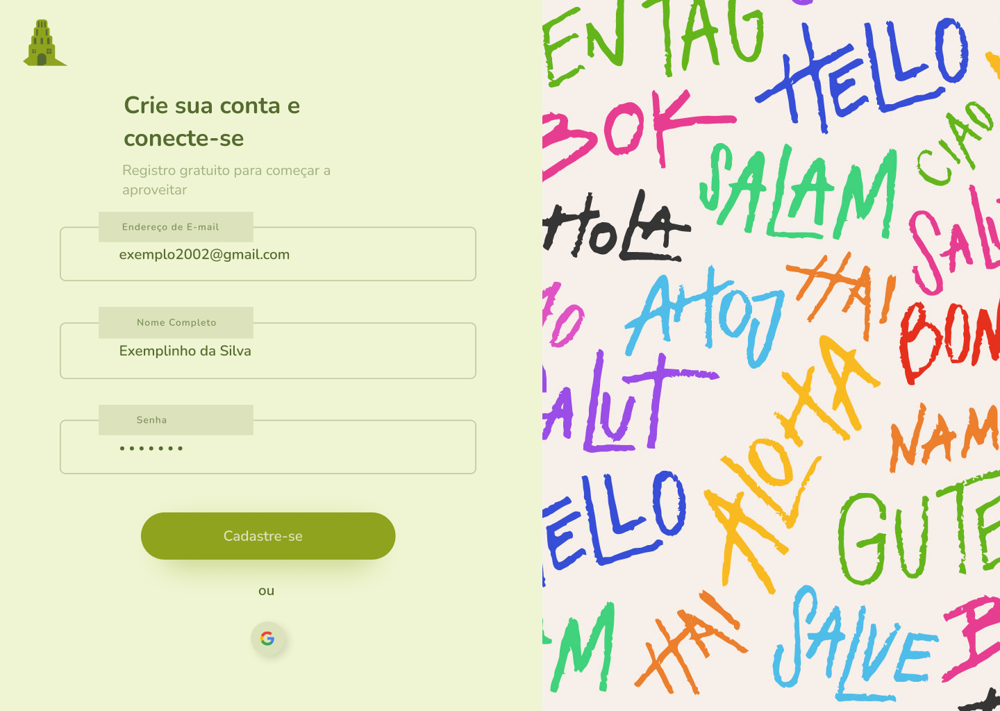
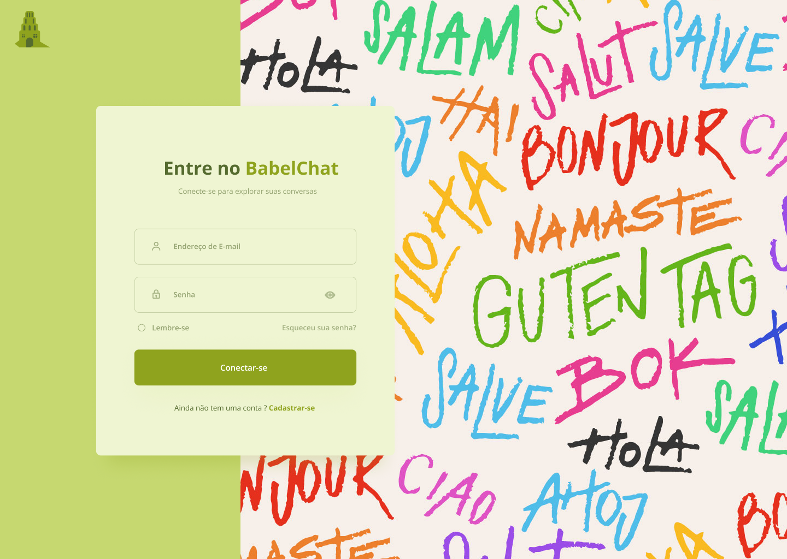
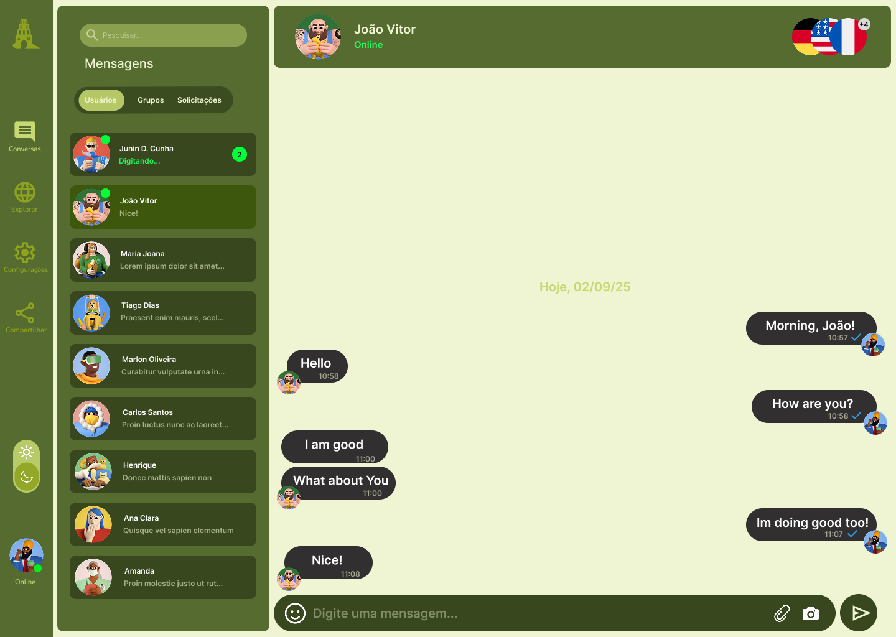
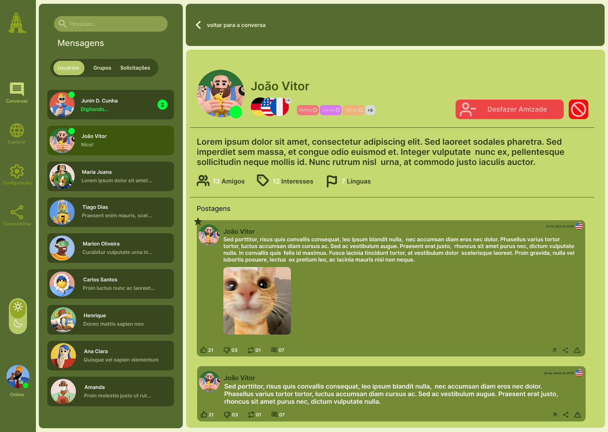
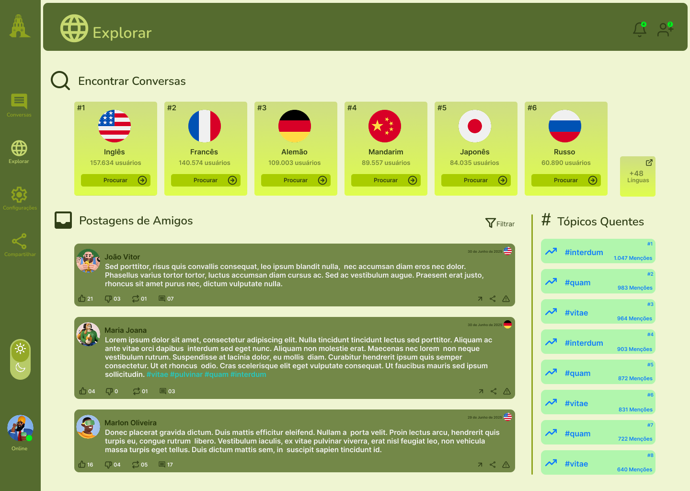

# Protótipo

## Introdução

O protótipo é uma representação visual e interativa da solução proposta, cujo objetivo principal é simular a experiência do usuário com o sistema final. Essa etapa é fundamental porque permite validar ideias de forma antecipada, testar fluxos de navegação e obter feedback direto antes de iniciar a implementação real, reduzindo custos e retrabalhos. Nesse projeto, o protótipo foi desenvolvido a partir de artefatos anteriores, como o mapa mental e as rich pictures, o que possibilitou uma transição mais clara e estruturada entre as ideias iniciais e a aplicação prática. Além disso, o uso de protótipos trouxe vantagens como maior clareza para os stakeholders, agilidade na identificação de falhas ou melhorias necessárias e a oportunidade de realizar testes rápidos, garantindo que a solução final esteja mais alinhada às expectativas dos usuários.

## Metodologia

A elaboração do protótipo foi realizada na plataforma Figma, escolhida devido à sua interface intuitiva, aos recursos de colaboração em tempo real e às funcionalidades avançadas para design de interfaces. Para estruturar o trabalho, o grupo se reuniu e definiu os principais fluxos do sistema, incluindo a navegação inicial, as funcionalidades essenciais e a organização do conteúdo.

## Artefato produzido

### Landing Page

 

### SignUp

### LogIn

### Chat

### User Profile

### Explore

### Histórico de Versão

| Versão | Data       | Descrição                     | Autor                             | Revisor           |
|--------|------------|-------------------------------|-----------------------------------|-------------------|
| 1.0    | 02/09/2025 | Criação da estrutura do documento | [Pedro Ferreira Gondim](https://github.com/G0ndim) | [Túlio Augusto Celeri](https://github.com/TulioCeleri) |
| 2.0    | 02/09/2025 | Adição da Introdução e Metodologia | [Túlio Augusto Celeri](https://github.com/TulioCeleri) | [Pedro Ferreira Gondim](https://github.com/G0ndim) |
| 3.0    | 02/09/2025 | Adição dos protótipos das páginas | [Pedro Ferreira Gondim](https://github.com/G0ndim) | [Túlio Augusto Celeri](https://github.com/TulioCeleri) |

