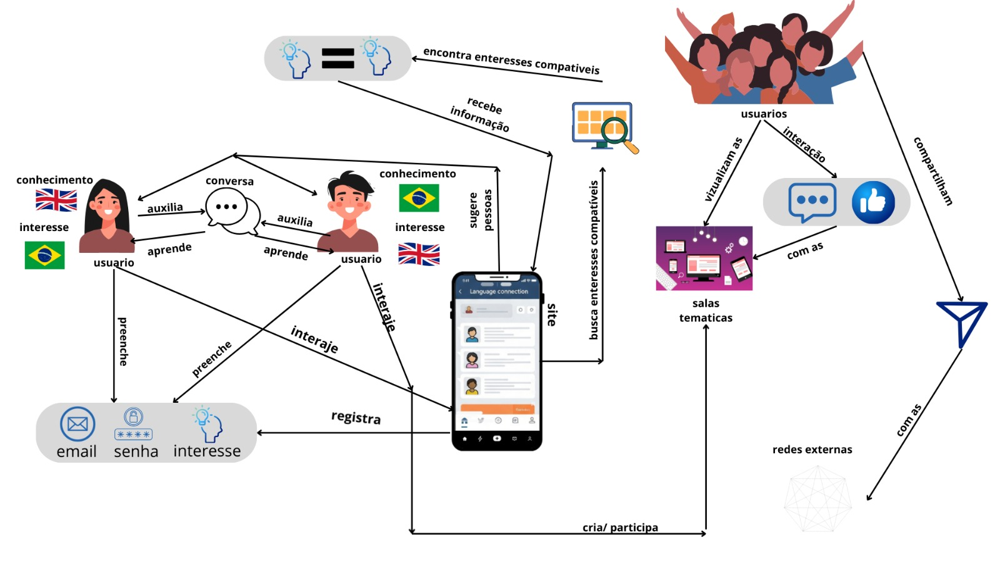
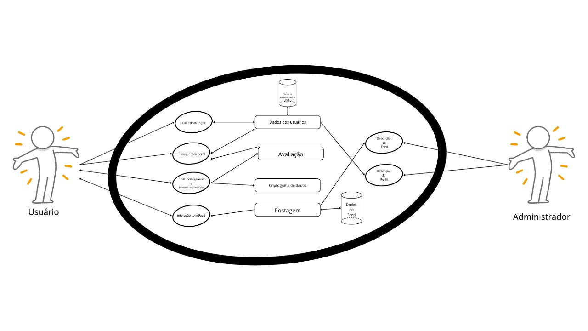
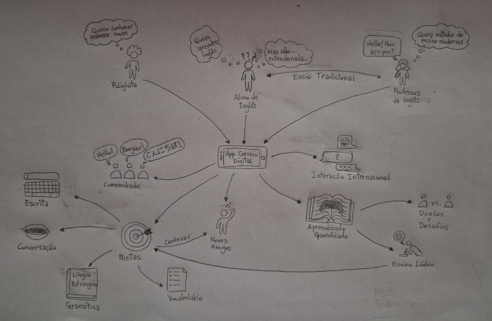
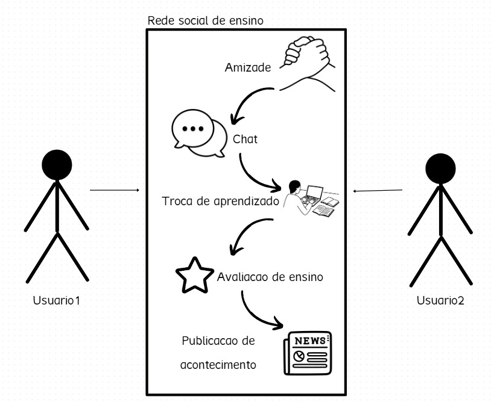
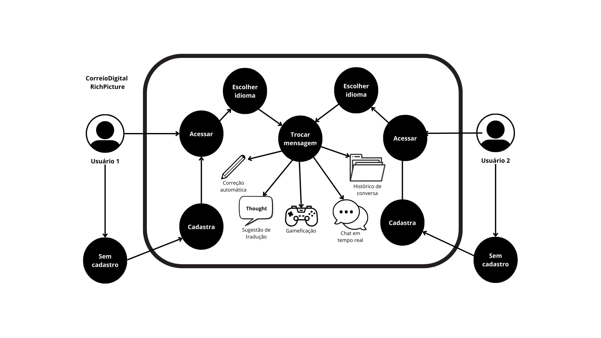
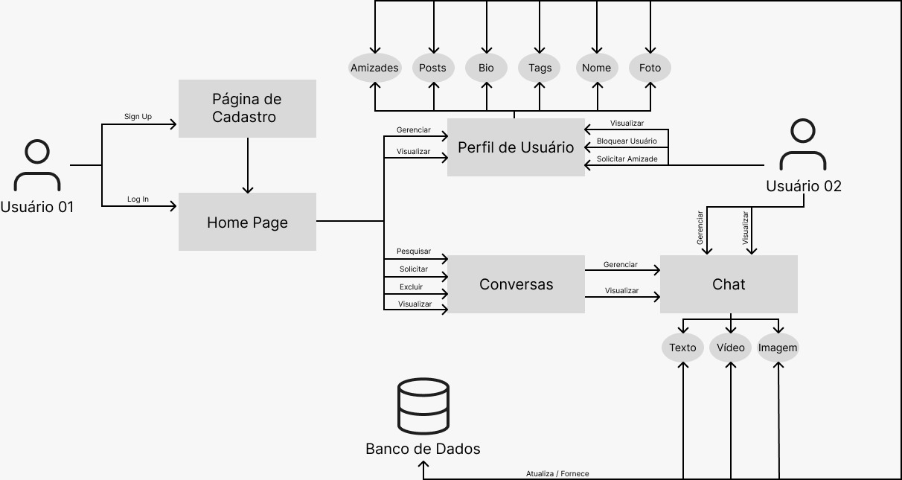
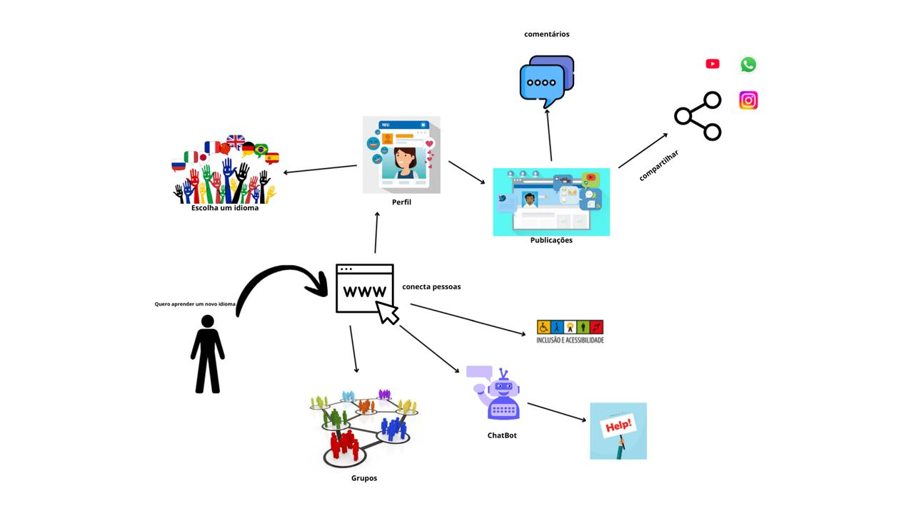

# Rich Picture

## Introdução

Rich Pictures são um desenho, uma imagem, de um sistema ou ‘situação’. Eles pretendem ser uma representação compartilhada do sistema; o valor que eles geram geralmente está principalmente no processo e nas discussões que isso gera, e não na imagem em si como resultado. <a id=anchor_1 href="#REF1">[1]</a>

## Objetivo/Metodologia

Para a elaboração do nosso rich picture, ficou decidido em nossa segunda reunião, que cada um elaboraria um rich picture até a aula de segunda-feira dia 01/09. Assim, cada um analisou o brainstorming e montou seu rich picture individual. Nosso objetivo é que fique visual ao nosso cliente o sistema do nosso site. Todos montaram o rich picture utilizando a ferramenta [Canva](https://www.canva.com/) igual ao esboço inicial.

## Rich Picture

### Rich Picture de Eric Akio Lages Nishimura

Não elaborou o rich picture.

### Rich Picture de Esther Sena Martins 

Abaixo, na imagem 1, está o rich picture de Esther Sena Martins.

Imagem 1: Rich Picture - Esther Sena Martins

Fonte: SENA, Esther. 2025.

### Rich Picture de Guilherme Moura da Silva Neto 

Não elaborou o rich picture.

### Rich Picture de João Pedro Costa

Abaixo, na imagem 2, está o rich picture de João Pedro Costa.

Imagem 2: Rich Picture - João Pedro Costa

Fonte: COSTA, João. 2025.

### Rich Picture de João Pedro Veras

Abaixo, na imagem 3, está o rich picture de João Pedro Veras.

Imagem 3: Rich Picture - João Pedro Veras

Fonte: VERAS, João. 2025.

### Rich Picture de Júlia Gabriela Cunha Paulino

Abaixo, na imagem 4, está o rich picture de Julia Gabriela Cunha Paulino.

Imagem 4: Rich Picture - Júlia Gabriela Cunha Paulino

Fonte: GABRIELA, Júlia. 2025.

### Rich Picture de Mariiana Siqueira Neris

Abaixo, na imagem 5, está o rich picture de Mariiana Siqueira Neris.

Imagem 5: Rich Picture - Mariiana Siqueira Neris

Fonte: SIQUEIRA, Mariiana. 2025.

### Rich Picture de Pedro Ferreira Gondim

Abaixo, na imagem 6, está o rich picture de Pedro Ferreira Gondim.

Imagem 6: Rich Picture - Pedro Ferreira Gondim

Fonte: GONDIM, Pedro. 2025.

### Rich Picture de Thales Germano

Não elaborou o rich picture.

### Rich Picture de Túlio Augusto Celeri

Abaixo, na imagem 7, está o rich picture de Túlio Augusto Celeri.

Imagem 7: Rich Picture - Túlio Augusto Celeri

Fonte: AUGUSTO, Túlio. 2025.

## Referências 

> <a id="REF1" href="#anchor_1">[1]</a> Barbrook-Johnson, P., Penn, A.S. (2022). Rich Pictures. In: Systems Mapping. Palgrave Macmillan, Cham. https://doi.org/10.1007/978-3-031-01919-7_2

## Histórico de Versões

| Versão |     Data    | Descrição   | Autor(es) | Revisor(es) |
| ------ | ----------- | ----------- | --------- | ----------- |
| `1.0`  | 01/09/2025  | Criação do documento e adição de todos RichPicture  | Esther Sena e Mariiana Siqueira | Pedro Gondim e Túlio Augusto |
