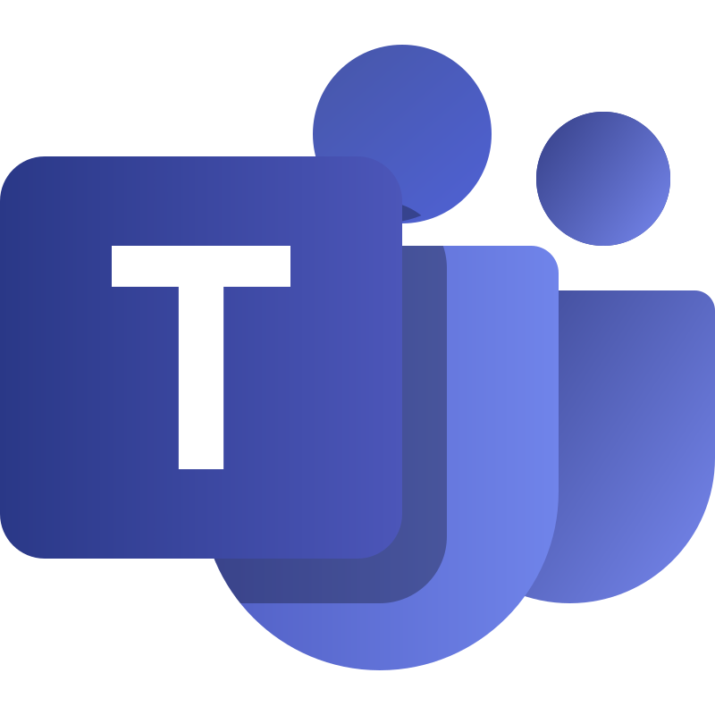

# Ferramentas Utilizadas

## Introdução

Na execução desta etapa do projeto da disciplina, diferentes ferramentas foram adotadas. O detalhamento de sua utilização é fundamental para tornar a manutenção mais simples, permitir que os resultados sejam reproduzidos e contribuir para o aperfeiçoamento da documentação.

<b>Tabela:</b> Ferramentas Utilizadas

| Logo | Ferramenta | Finalidade |
| :-----: | :----: | ----------- |
|  | [GitHub](https://github.com/) | Plataforma utilizada para o versionamento de documentação e hospedar o gitpages do projeto |
|       | [Visual Studio Code](https://code.visualstudio.com/) | O Vscode foi utilizado pelo grupo para escrever a documentação e subi-lá para o github |
|         | [Teams](https://www.microsoft.com/pt-br/microsoft-teams/free) | O Teams foi usado para fazer as reuniões do grupo|
|        | [WhatsApp](https://www.whatsapp.com/) | Plataforma utilizada para planejamento de atividades pelo grupo |
|         | [Canva](https://www.canva.com/) | Plataforma utilizada para fazer os mapas mentais e rich pictures |
|     | [Youtube](https://www.youtube.com/) | Plataforma utilizada para disponibilizar a gravação da entrevista |
|       | [Figma](https://www.figma.com/pt-br/) | Ferramenta utilizada para a realização do protótipo da aplicação |
|     | [Docsify](https://docsify.js.org/#/?id=docsify) | Ferramenta utilizada para gerar a página de documentação do projeto |
|     | [BPMN.IO](https://bpmn.io/) | Ferramenta utilizada para fazer os diagramas BPMN |

<b>Autor:</b> [Túlio Augusto Celeri](https://github.com/TulioCeleri), 2025.

---

### Histórico de Versão

| Versão | Data       | Descrição                                      | Autor               | Revisor            |
|--------|------------|------------------------------------------------|---------------------|--------------------|
| 1.0    | 04/09/2025 | Criação do documento de Ferramentas Utilizadas | [Túlio Augusto Celeri](https://github.com/TulioCeleri)  | [Pedro Ferreira Gondim](https://github.com/G0ndim)          |