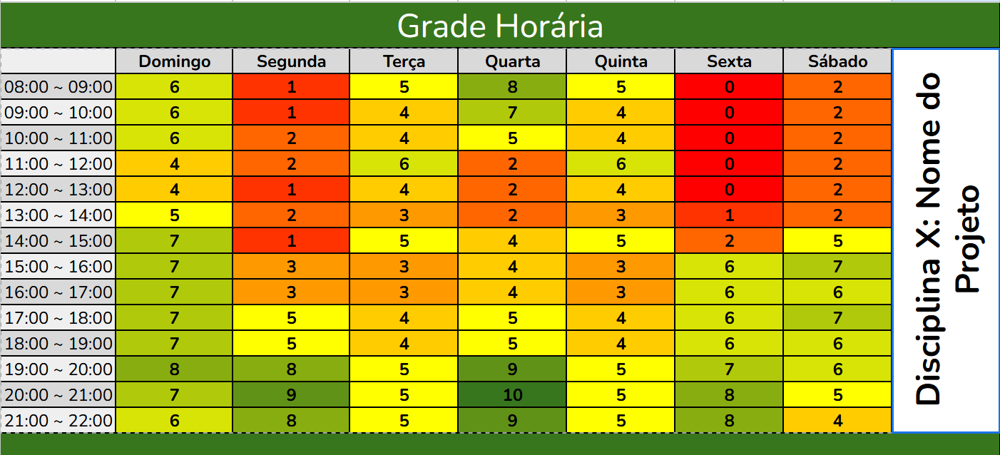

# Heatmap

## Introdução

Um heatmap é uma representação visual em forma de grade, onde cores diferentes indicam a intensidade ou frequência de um dado. No contexto de disponibilidade de horários para grupos, ele mostra os períodos em que mais pessoas estão livres, facilitando a escolha do melhor momento para todos. Cada célula do mapa corresponde a um intervalo de tempo, ficando mais clara ou escura conforme a quantidade de pessoas disponíveis. Dessa forma, o grupo consegue visualizar rapidamente padrões e tomar decisões de agenda de forma colaborativa.

## Metodologia

Para fazer o HeatMap foi utilizado o Google Planilhas. E, ao analisar o resultado do heatmap verificou-se que o melhor dia para reuniões é quarta feira das 20:00 às 21:00.

**Figura 1:** Heatmap

**Autor:** [João Pedro Veras](https://github.com/JoosPerro), 2025.

## Bibliografia

> 
> Google Planilhas. Disponível em: https://workspace.google.com/intl/pt-BR/products/sheets/. Acesso em: 04 de set. de 2025.  

### Histórico de Versão

| Versão | Data       | Descrição                                      | Autor               | Revisor            |
|--------|------------|------------------------------------------------|---------------------|--------------------|
| 1.0 | 09/04/2025 | Criação do documento do HeatMap | [Túlio Augusto Celeri](https://github.com/TulioCeleri) | [Pedro Ferreira Gondim](https://github.com/G0ndim) |
