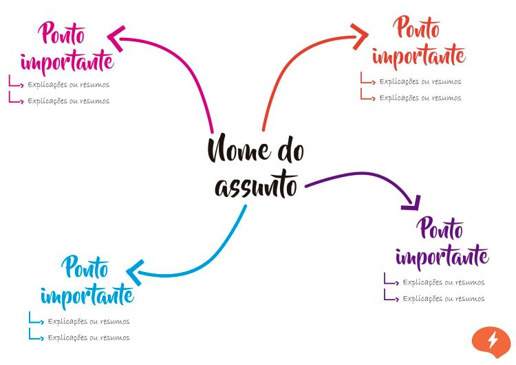
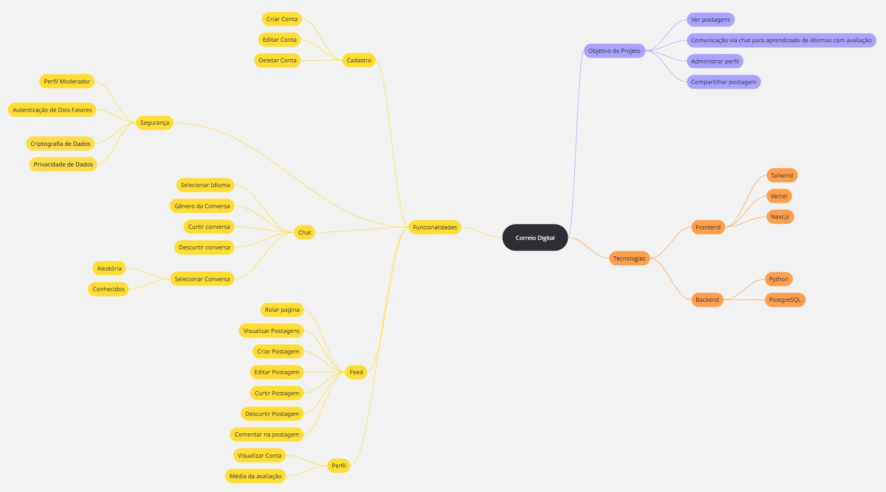
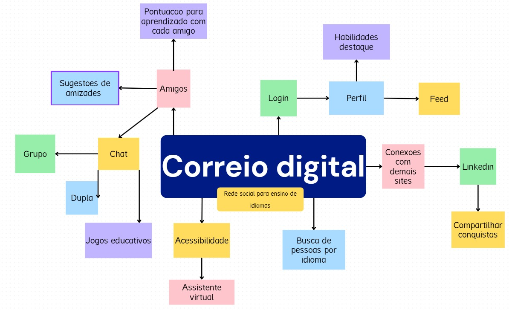
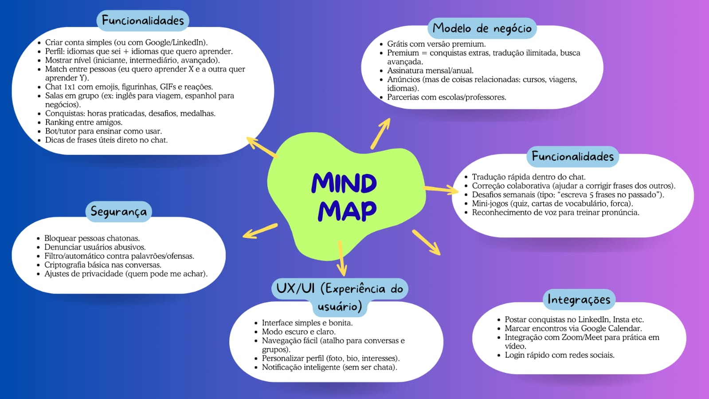
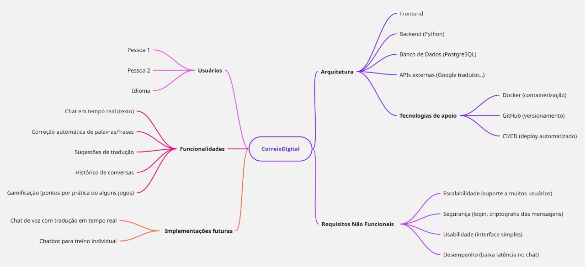
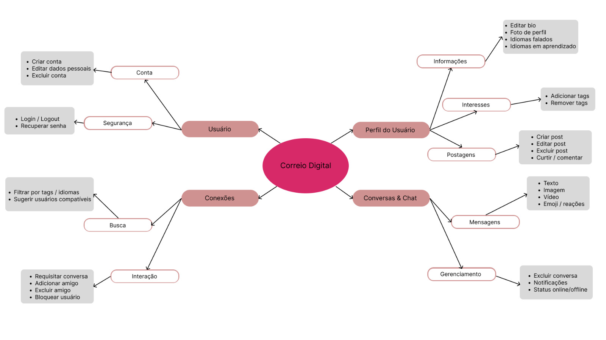
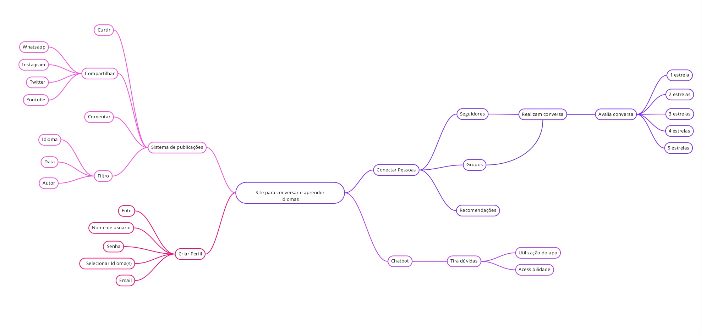

# Mapa Mental

## Introdução

// Adicionar introdução

## Metodologia

A construção dos mapas mentais seguiu uma abordagem colaborativa. Inicialmente, foi realizada uma reunião presencial em sala de aula, onde ocorreu uma sessão de brainstorming para levantar ideias relacionadas ao projeto. As contribuições foram organizadas por temas e, posteriormente, estruturadas na plataforma Miro.

Cada integrante elaborou seu próprio mapa mental com base na perspectiva que tinha da aplicação, após o desenvolvimento de brainstormings em grupo. Os mapas mentais foram desenvolvidos em plataformas online de desenho e planejamento.

**Figura 1:** Exemplo de estrutura de mapa mental

 
Em seguida, apresenta-se os mapas mentais produzidos pelos integrantes.

## Artefatos produzidos

<b>João Pedro Costa</b>

**Figura 2:** Mapa Mental João Pedro Costa

**Autor:** [João Pedro Costa](https://github.com/johnaopedro), 2025.

<b>Julia Gabriela</b>

**Figura 3:** Mapa Mental Julia Gabriela

**Autor:** [Julia Gabriela](https://github.com/JuliaGabP), 2025.

<b>Esther Sena</b>

**Figura 4:** Mapa Mental Esther Sena

**Autor:** [Esther Sena](https://github.com/esmsena), 2025.

<b>Mariiana Neris</b>

**Figura 5:** Mapa Mental Mariiana Neris

**Autor:** [Mariiana S. Neris](https://github.com/Maryyscreuza), 2025.

<b>Pedro Gondim</b>

**Figura 6:** Mapa Mental Pedro Gondim

**Autor:** [G0](https://github.com/G0ndim), 2025.

<b>Tulio Augusto</b>

**Figura 7:** Mapa Mental Tulio Augusto

**Autor:** [Túlio Celeri](https://github.com/TulioCeleri), 2025.

## Bibliografia

> LUCIDCHART. *O que é um mapa mental e como fazer um*. Disponível em: <https://www.lucidchart.com/pages/pt/o-que-e-mapa-mental-e-como-fazer>. Acesso em: 1 de setembro de 2025.

### Histórico de Versão

| Versão | Data       | Descrição                                      | Autor               | Revisor            |
|--------|------------|------------------------------------------------|---------------------|--------------------|
| 1.0    | 01/09/2025 | Criação do documento | [João Pedro Costa](https://github.com/johnaopedro)   |  [Julia Gabriela](https://github.com/JuliaGabP)  |
| 1.1    | 01/09/2025 | Adição dos mapas mentais individuais | [João Pedro Costa](https://github.com/johnaopedro) |  [Julia Gabriela](https://github.com/JuliaGabP)  |